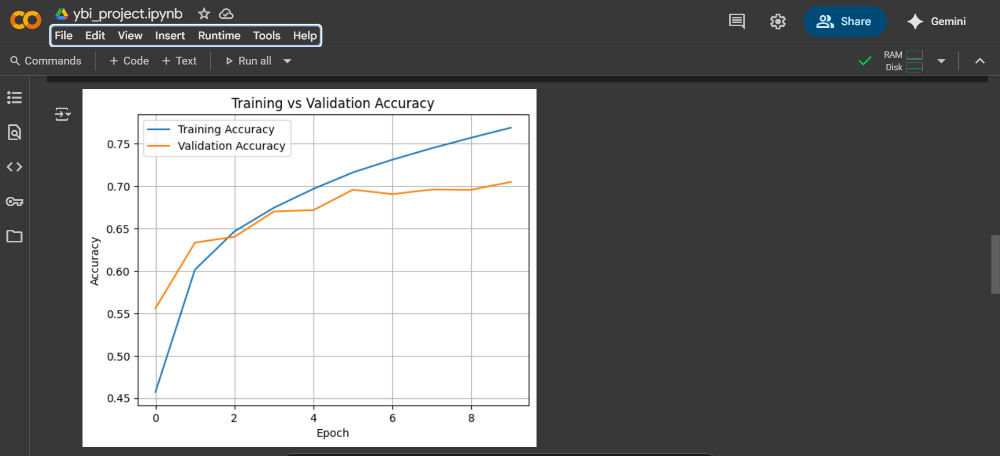
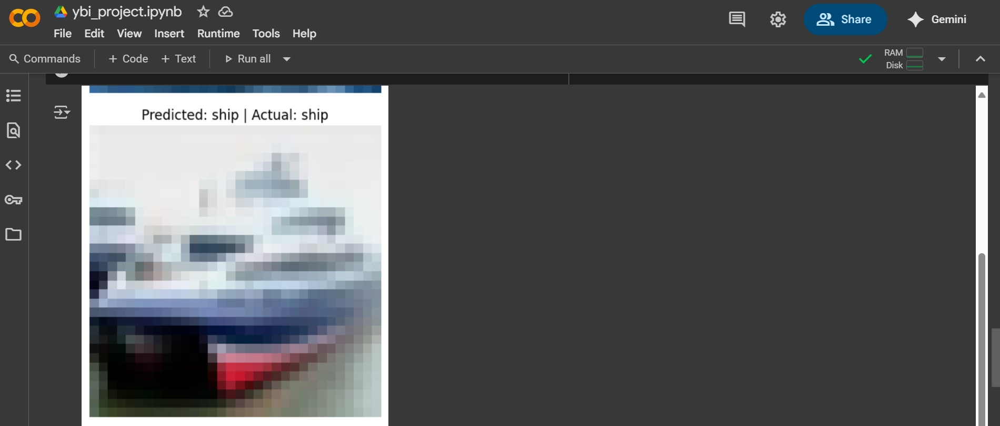
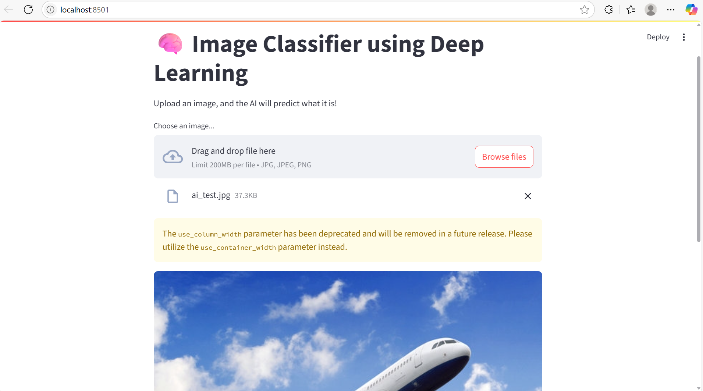
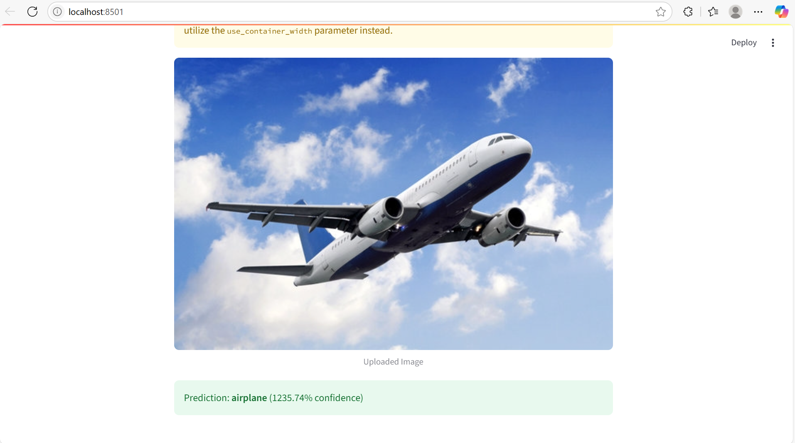
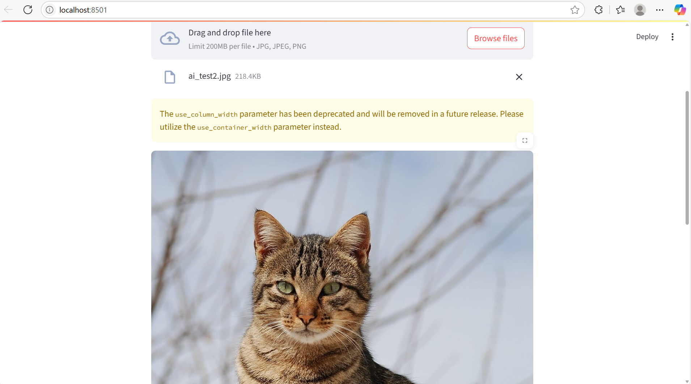
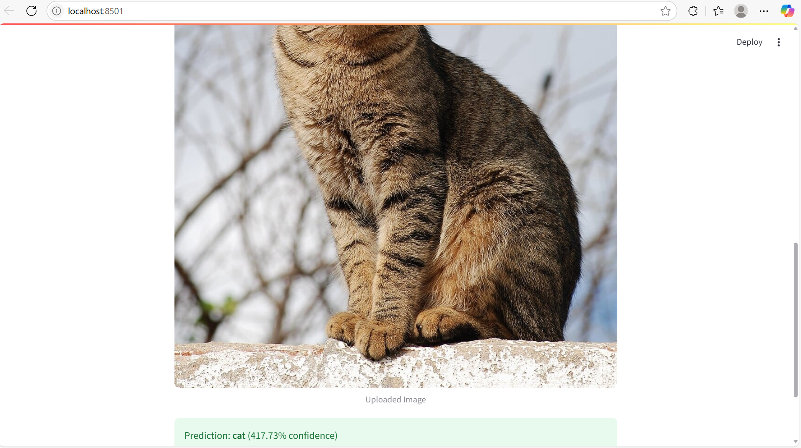
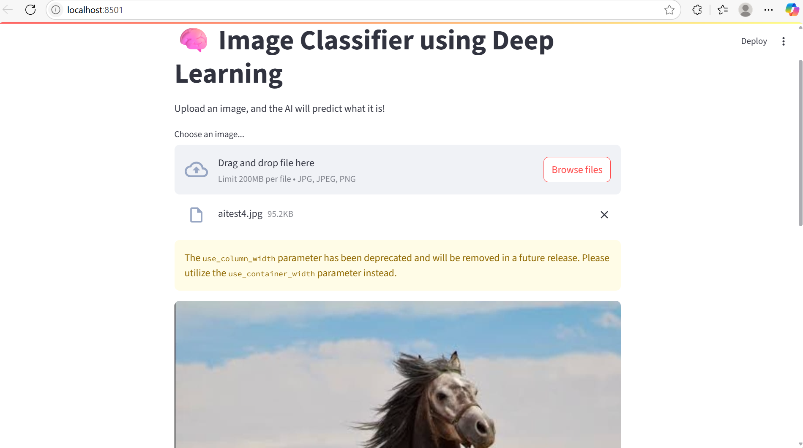
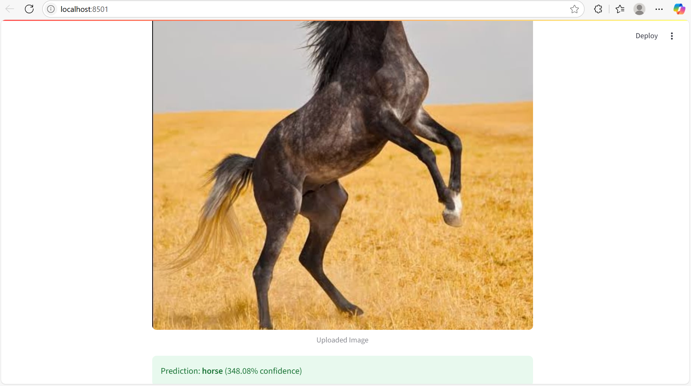

# ybi-ai-project
Image Classification using CNN (YBI Internship)
This is a deep learning-based image classification project built during my internship at **YBI Foundation**.

## 🚀 Project Overview

This project uses a **Convolutional Neural Network (CNN)** trained on the **CIFAR-10 dataset** to classify images into 10 different object categories.

The model can identify the following objects:
- Airplane ✈️
- Automobile 🚗
- Bird 🐦
- Cat 🐱
- Deer 🦌
- Dog 🐶
- Frog 🐸
- Horse 🐴
- Ship 🚢
- Truck 🚚

## 🔧 Technologies Used

- Python  
- TensorFlow / Keras  
- Google Colab  
- Streamlit (for frontend app)  
- VS Code / Spyder (for local development)  
- CIFAR-10 Dataset (from keras.datasets)

## 📂 Project Files

| File | Description |
|------|-------------|
| ybi_project.ipynb | Google Colab notebook for training/testing |
| cnn_model.keras | Trained CNN model file |
| app.py | Streamlit-based frontend interface |
| training_result.png | Screenshot of model training accuracy |
| app_ui.png | Screenshot of the frontend UI |
| prediction_result.png | Screenshot showing prediction result |

## ▶️ How to Run the App

1. Clone or download this repository.  
2. Install the required libraries:
   pip install tensorflow streamlit numpy  
3. Run the frontend:
   streamlit run app.py  
4. Upload an image and view the predicted class label.

## 📸 Screenshots

### 🔹 Model Training Output  

###     Model tesing Output 

### 🔹 App Interface and Prediction Output

## 🏁 Conclusion

This internship project gave me hands-on experience in deep learning, image recognition, and model deployment.

Special thanks to **YBI Foundation** for this learning opportunity!

